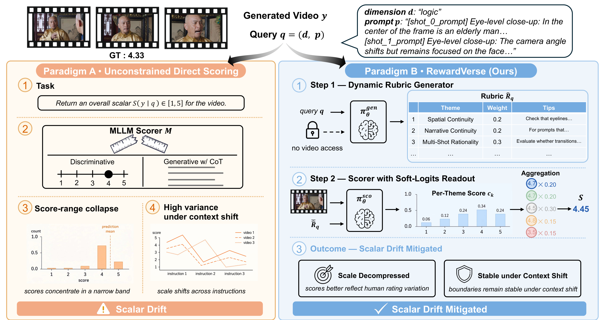
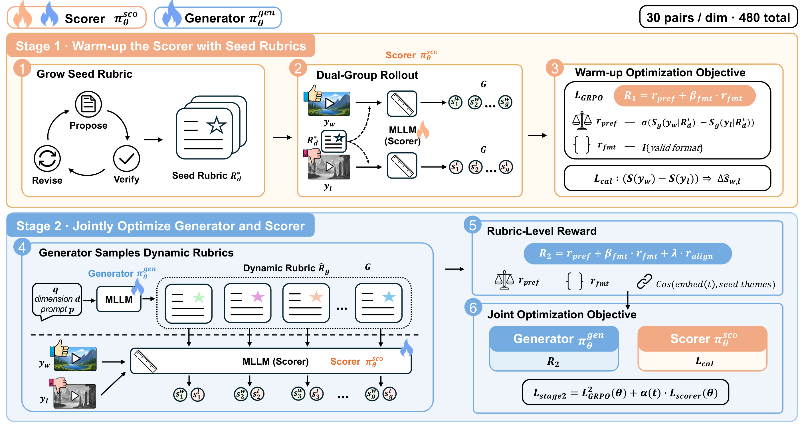

<div align="center">

# RewardVerse

### Rubric-Guided Policy Optimization for Video Reward Modeling

[](https://2kxx.github.io/RewardVerse/)
[](https://2kxx.github.io/RewardVerse/rewardverse.pdf)
[](#)
[](#-code-release)

**Zhenchen Tang**<sup>1,2,4</sup> · **Yang Li**<sup>1,2,4</sup> · **Songlin Yang**<sup>3,4</sup> · **Bo Peng**<sup>1,2</sup> ·
**Xiaotong Zhao**<sup>4</sup> · **Shuai Li**<sup>4</sup> · **Haotian Fan**<sup>4</sup> · **Alan Zhao**<sup>4</sup> · **Jing Dong**<sup>1,2,\*</sup>

<sup>1</sup>New Laboratory of Pattern Recognition, Institute of Automation, Chinese Academy of Sciences<br>
<sup>2</sup>School of Artificial Intelligence, University of Chinese Academy of Sciences<br>
<sup>3</sup>The Hong Kong University of Science and Technology<br>
<sup>4</sup>Tencent

</div>

---

<div align="center">

<br>
<em>Unconstrained scorers suffer from <b>scalar drift</b>. RewardVerse inserts a <b>dynamic rubric</b> — themes, weights, and scoring tips generated from the query alone — as an intermediate representation that anchors the scoring process.</em>
</div>

---

## 🔍 TL;DR

Video reward models usually map a video straight to one scalar, with no explicit notion of *what* is being checked. The scoring scale then collapses into a narrow high band or shifts across prompts — a failure mode we call **scalar drift**.

**RewardVerse** treats the rubric as a learned intermediate representation:

1. **Dynamic rubric generator** — from the evaluation query $(d, p)$ only (never the video), it emits a schema-constrained rubric of themes $t_k$, weights $w_k$ (summing to 1), and execution tips $T_k$.
2. **Rubric-guided scorer** — scores each theme with a *soft-logits* readout, i.e. the expected value over the logits of rating tokens `1`–`5`, then aggregates the per-theme scores by their weights. This avoids fragile free-form score parsing and keeps the score continuous.
3. **Rubric-Guided Policy Optimization (RGPO)** — a two-stage GRPO recipe that (i) warms up the scorer against self-evolving seed rubrics and (ii) jointly optimizes the rubric generator, while a human-aligned margin calibration loss keeps the scorer's score gaps faithful to human ratings.


## 🧩 Method at a Glance

<div align="center">

</div>

**Stage 1 — Seed-guided scorer warm-up.** A frontier MLLM *proposes → verifies → revises* rubrics over 30 preference pairs per dimension; verified rubrics are deduplicated and reduced to $M{=}5$ representatives. The scorer is then optimized with a GRPO objective combining a sigmoid pairwise preference reward, a format reward, and a **human-aligned margin calibration loss** that matches the predicted score gap to the human margin.

**Stage 2 — Joint policy optimization.** The generator samples $G$ dynamic rubrics per triple; each rubric is rewarded by how well its induced pointwise scores separate the preferred from the non-preferred video, plus format and BGE-M3 embedding-alignment terms. The two roles receive **asymmetric signals**: the generator is optimized by rubric-level GRPO, while the scorer is calibrated against human margins with the rubric treated as fixed context.

## 🚧 Code Release

The implementation is being cleaned up and will be released **upon acceptance** — training code,
preference splits, seed rubrics, trained reward models, and evaluation scripts.

Please **watch / star** this repository to be notified when the release lands.

## 📚 Citation

```bibtex
@article{tang2026rewardverse,
  title   = {RewardVerse: Rubric-Guided Policy Optimization for Video Reward Modeling},
  author  = {Tang, Zhenchen and Li, Yang and Yang, Songlin and Peng, Bo and
             Zhao, Xiaotong and Li, Shuai and Fan, Haotian and Zhao, Alan and
             Dong, Jing},
  journal = {arXiv preprint},
  year    = {2026}
}
```

## 🙏 Acknowledgements

We thank the maintainers of EvalVerse, VideoGen-RewardBench (VGRB), VBench, Qwen2.5-VL, and Wan-2.2,
whose datasets, benchmarks and models made this study possible.

## ⚖️ License

The released code and models will be provided under the Apache-2.0 license. The paper text and figures
are shared for academic use; please cite the paper if you use them.

---

<div align="center">
<sub>If you find this work useful, please consider starring the repository ⭐</sub>
</div>
